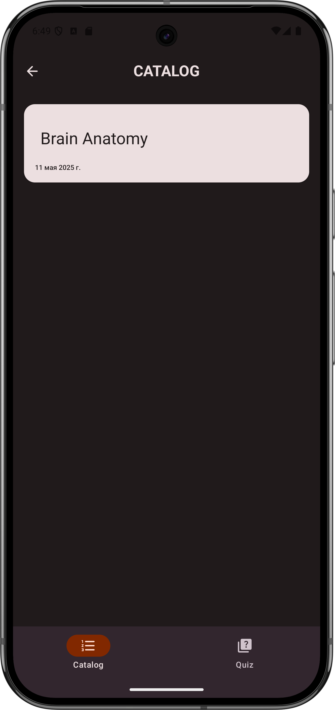
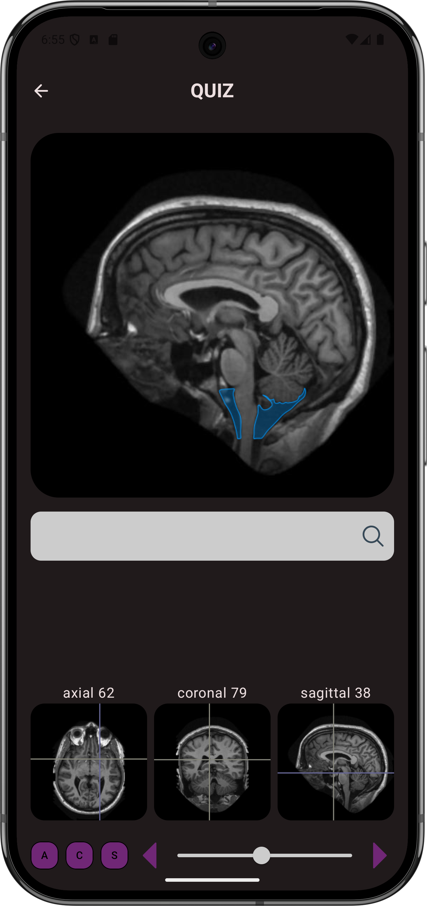

<h1 align="center">🧠 MRIQ</h1>

Сервис  викторин по анатомии для студентов мед. вузов

  
  
  

---

## 📝 Описание

**MRI***Q* — сервис викторин по анатомии. Реализован бекенд и мобильное (Android) приложение.  
Поддерживает **персонализацию вопросов** на основе результатов пользователя.

---

## 🧩 Архитектура

Проект реализован с использованием **многомодульного подхода**. Ниже приведены ключевые модули:

| Модуль                | Назначение                                                                      |
|-----------------------|---------------------------------------------------------------------------------|
| `:demo`               | Точка входа в приложение. Интегрирует функциональность `:feature:`-модулей.     |
| `:mock`               | Тестовые данные для дебага и юнит-тестов.                                       |
| `:feature:*`          | Модули с пользовательской логикой. Зависят от `:core:`-модулей.                 |
| `:feature:quiz`       | Логика викторины: генерация вопросов, проверка ответов.                         |
| `:core:*`             | Ключевая архитектурная основа: работа с сетью, локальное хранилище, интерфейсы. |
| `:core:data`          | Абстрактные репозитории + DI через Hilt.                                        |
| `:core:database`      | DAO и модели для Room. Управление целостностью БД.                              |
| `:core:design-system` | Темы, цвета, шрифты — единый стиль интерфейса.                                  |
| `:core:ui`            | Переиспользуемые UI-компоненты (кнопки, диалоги и др).                          |
| `:core:model`         | Модели доменного уровня всего приложения.                                       |
| `:core:network`       | REST-интеграция, обёртка над API и удалёнными запросами.                        |

---

## 🛠️ Технологии

- Kotlin + Jetpack Compose
- Dagger Hilt (DI)
- Room (БД)
- Retrofit (Сеть)
- Clean Architecture + Multi-module
- Android Gradle Plugin (KTS)

---

## 📸 Скриншоты

<strong>Каталог (Главный экран)</strong>

    

<strong>Экран викторины</strong>

    

---

## 🚀 Запуск проекта

1. Добавить в local.properties строчку apiurl=http://<ip>:<port>/
2. Собрать проект